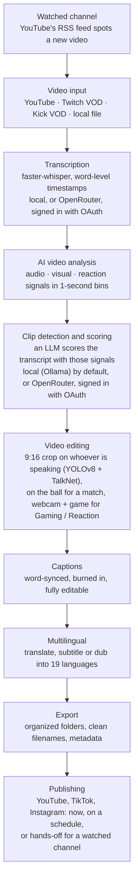

# Architecture: Kaazi Clips

Kaazi Clips is a local-first AI clipping engine with a desktop front end. It ingests a
long video, finds the moments worth posting using an LLM plus multimodal signal
analysis, renders speaker-tracked captioned vertical clips, and hands them to a review
and editing studio. By default nothing is sent to a cloud AI service and there is no
paid inference anywhere in the pipeline; cloud AI is an opt-in on the user's own
account ([Cloud AI](#cloud-ai-opt-in)). Opt-in modes change the framing and the scoring
for game streams, matches, lives that were already vertical, and 16:9 output.

This document describes the system as it is built today. It is the only architecture
document: design notes that used to live separately have been folded in here.

**Contents**

1. [System overview](#1-system-overview)
2. [Repository structure](#2-repository-structure)
3. [The processing pipeline](#3-the-processing-pipeline)
4. [Clip scoring](#4-clip-scoring)
5. [Face tracking and framing](#5-face-tracking-and-framing)
6. [Creator intelligence](#6-creator-intelligence)
7. [Multilingual publishing](#7-multilingual-publishing)
8. [Long-form output](#8-long-form-output)
9. [The video editor](#9-the-video-editor)
10. [Local API service](#10-local-api-service)
11. [Desktop application](#11-desktop-application)
12. [State and storage](#12-state-and-storage)
13. [Configuration surface](#13-configuration-surface)
14. [Windows packaging](#14-windows-packaging)
15. [Design rules](#15-design-rules)

---

## 1. System overview

```
┌──────────────────────────┐  ┌──────────────────────────┐  ┌──────────────────────────┐
│ Desktop app              │  │ Watched channels,        │  │ Assistants               │
│ Electron + React + Vite  │  │ streamer-tool hand-offs  │  │ Ask Kaazi Clips · MCP    │
└────────────┬─────────────┘  └────────────┬─────────────┘  └────────────┬─────────────┘
             └─────────────────────────────┼─────────────────────────────┘
                                           │  HTTP + WebSocket (127.0.0.1:8765)
                  ┌────────────────────────▼────────────────────────┐
                  │ FastAPI service (server/)                       │
                  │ queue · progress events · publisher · webhooks  │
                  └────────────────────────┬────────────────────────┘
                                           │
┌──────────────────────────────────────────▼───────────────────────────────────────────┐
│                                                                                      │
│                             PIPELINE (core/pipeline.py)                              │
│                                                                                      │
│ SOURCE ──► DOWNLOAD ──► TRANSCRIBE ──► ANALYZE ───►  RENDER ───────► METADATA        │
│ YouTube    yt-dlp       Whisper,       signals +     framing by mode titles,         │
│ Twitch                  local, or      the LLM,      + captions,     descriptions,   │
│ Kick                    cloud on the   local or      here or on a    hashtags        │
│ local file              user's account cloud         render PC                       │
│                                                                                      │
│ signals: audio · visual · reaction · text · engagement                               │
│ side channels: creator knowledge · chat replay · heatmaps · game metadata ·          │
│                score box (OCR) · crowd, whistle and game sounds (PANNs)              │
│ framing by mode: speaker tracking (standard) · webcam + game (Gaming / Reaction)     │
│                  · the whole 9:16 frame (Vertical Live) · the ball (Sports)          │
│                  · 16:9 (Longform) · per shot (Podcast)                              │
│                                                                                      │
└──────────────────────────────────────────┬───────────────────────────────────────────┘
                                           │
          ┌─────────────────────┬──────────┴──────────┬─────────────────────┐
          ▼                     ▼                     ▼                     ▼
┌───────────────────┐ ┌───────────────────┐ ┌───────────────────┐ ┌───────────────────┐
│ SQLite state      │ │ Rendered clips    │ │ Creator KB        │ │ Publishing        │
│ core/state.py     │ │ data/clips/       │ │ knowledge +       │ │ YouTube ·         │
│                   │ │                   │ │ events            │ │ WoopSocial ·      │
│                   │ │                   │ │                   │ │ Upload-Post       │
└───────────────────┘ └───────────────────┘ └───────────────────┘ └───────────────────┘
```

By default everything in that diagram runs on the local machine. The only network calls
a normal run makes are **yt-dlp fetching the source video** and, for Twitch VODs, an
optional chat-replay request. Whisper, the LLM, YOLOv8, and FFmpeg are all local.

Three things add network paths, and each is off until the user turns it on: **cloud AI**
(the transcript, or the audio for cloud transcription, goes to the provider the user
signed in to), **publishing** (finished clips go to the platforms, directly or through a
publishing service) and **remote rendering** (one clip's stretch of video goes to the
user's own render PC, [10.3](#103-remote-rendering)).

### End to end

The same flow as the README, from a watched channel to a published clip:



### The AI stack

| Job | Tool | Where it runs |
|---|---|---|
| Download | yt-dlp | local |
| Transcription | faster-whisper, word-level timestamps | local, CUDA or CPU; or a cloud Whisper on the user's account |
| Clip scoring, titles, translation, edit chat, assistant | any Ollama model (Gemma by default), or a cloud model | local via Ollama; or OpenRouter or a direct provider on the user's account |
| Person/pose detection | YOLOv8 (`yolov8n-pose.pt`) + OpenCV | local, CUDA or CPU |
| Text on screen (score box, game banners) | RapidOCR | local |
| Sound events (crowd, whistle, game sounds) | PANNs (an AudioSet tagger) | local |
| Who is talking (the second speaker's caption colour) | pyannote segmentation + WeSpeaker speaker model, on onnxruntime | local, CPU, one core |
| Ball detection (Sports) | YOLOv8n, "sports ball" | local |
| Rendering | FFmpeg with hardware encoding (NVENC / AMF / QSV) | local |
| Dubbing voices | local TTS | local |

### Cloud AI (opt-in)

The LLM and transcription can each run in the cloud instead, on the user's own account,
chosen in Settings → AI ([docs/AI-BACKENDS.md](docs/AI-BACKENDS.md)). Local stays the
default and the first choice.

- `llm/providers/catalog.py` lists the providers: OpenRouter as the recommended cloud
  path, direct APIs (OpenAI, Anthropic, Gemini, xAI, Meta and others) as advanced. An
  OpenAI-compatible provider is one entry; a new wire format is one adapter in
  `llm/providers/adapters/`.
- Every request goes through `llm/providers/http.py`: the key in a header, plain-English
  errors, bounded retries. A failing cloud model fails the job; it never falls back to
  another provider or to local AI behind the user's back.
- OpenRouter can be signed in to instead of pasting a key: OAuth with PKCE
  (`llm/providers/oauth.py`), with the engine on localhost receiving the callback. The
  key it returns is the user's own and lives in the app's credential store
  (`llm/providers/keys.py`).
- OpenRouter requests carry its app-attribution headers (`llm/providers/openrouter.py`),
  so the usage counts toward OpenRouter's public app rankings.
- Cloud transcription (`transcription/cloud.py`) writes the same transcript cache as local
  Whisper, so every later stage is unchanged.

---

## 2. Repository structure

```
clips-studio/
├── main.py                     # CLI entry: process, serve, models, status, channels
├── config/
│   ├── settings.yaml           # quick setup at the top, advanced below
│   ├── prompts/                # every LLM prompt as an editable text file
│   ├── gaming.yaml             # kinds of game and what a highlight is in each
│   └── sports.yaml             # each sport's moments, windows and commentary words
├── core/
│   ├── pipeline.py             # stage orchestration for one video
│   ├── state.py                # SQLite schema + all queries
│   ├── models.py               # dataclasses shared between stages
│   ├── progress.py             # stage events → WebSocket
│   ├── cancel.py               # cooperative cancellation flags
│   ├── modes.py                # Vertical Live, Gaming / Reaction and Sports switches
│   ├── preflight.py            # can this install make a clip? (setup checks)
│   ├── binaries.py             # bundled FFmpeg, Ollama and model weights
│   ├── queue.py                # queue manager: order, pause, retry, estimate
│   ├── prefetch.py             # download-ahead for queued jobs
│   ├── housekeeping.py         # disk reclamation
│   └── scheduler.py            # (legacy CLI) `main.py run` poll loop; the app uses server/automation.py
├── sources/                    # ── one file per platform ──
│   ├── dispatch.py             # URL → the right source module
│   ├── youtube.py              # yt-dlp download, H.264 selection, heatmap
│   ├── twitch.py               # VOD download + chat replay
│   ├── kick.py                 # VOD download
│   ├── channel_feed.py         # what a watched channel posted (RSS, yt-dlp, Kick API)
│   ├── vod_finder.py           # the VOD a finished livestream left behind
│   └── ytdlp_common.py         # chunked, resumable download shared by all
├── transcription/
│   ├── transcriber.py          # faster-whisper, word timestamps, GPU/CPU fallback
│   └── cloud.py                # transcription on the user's own provider account
├── llm/                        # ── swappable model layer ──
│   ├── base.py                 # LLMBackend interface
│   ├── ollama_backend.py       # anything Ollama serves
│   ├── registry.py             # config string → backend instance
│   ├── manager.py              # install/switch/recommend models
│   ├── spec.py                 # which provider and model a backend spec names
│   └── providers/              # cloud AI on the user's own account: catalog, adapters,
│                               # http, keys, OAuth sign-in, OpenRouter attribution
├── analysis/                   # ── the clip engine ──
│   ├── audio_features.py       # loudness, spikes, burst density, laughter proxy
│   ├── visual_features.py      # scene cuts, motion, flashes, face metrics
│   ├── hype.py                 # Twitch chat replay + YouTube most-replayed
│   ├── gaming.py               # scores a gaming stream as a gaming stream
│   ├── game_audio.py           # what the game sounds like
│   ├── game_text.py            # what the game writes on screen
│   ├── game_vision.py          # the AI looks at a gaming stream's best candidates
│   ├── chat_moments.py         # what chat's reactions say happened
│   ├── panns.py                # PANNs sound tagger: game sounds, crowd, whistle
│   ├── voice_turns.py          # whose voice it is: the turns of anyone but the main speaker
│   ├── intent.py               # clip direction: what the clips should be about
│   ├── fusion.py               # candidate generation, weighted scoring, rerank
│   ├── highlights.py           # LLM transcript scoring + duplicate prevention
│   ├── metadata.py             # titles, descriptions, hashtags
│   ├── clip_edit.py            # AI edit chat → validated edit operations
│   └── tighten.py              # silence and filler-word removal
├── creator/                    # ── creator intelligence ──
│   ├── identity.py             # channel → creator profile resolution, merging
│   ├── extractor.py            # transcript → structured facts and events
│   ├── retrieval.py            # stored knowledge → scoring context
│   ├── learning.py             # preference learning from user actions
│   └── models.py               # knowledge types, thresholds
├── video/                      # ── rendering ──
│   ├── tracker.py              # YOLOv8 pose tracking, speaker-aware
│   ├── asd.py                  # TalkNet active-speaker detection
│   ├── framing.py              # crop-path smoothing and shot logic
│   ├── podcast.py              # multi-cam shot detection, per-shot framing
│   ├── cropper.py              # 9:16 render
│   ├── captions.py             # word-synced ASS captions
│   ├── cutter.py               # accurate clip extraction
│   ├── filters.py              # colour presets and adjustments
│   └── encoding.py             # encoder detection and selection
├── video_editor/               # ── manual editing applied to a clip ──
│   ├── timeline.py             # non-destructive edit model
│   ├── cuts.py                 # trims and internal cuts
│   ├── audio.py                # volume, fades, mutes, music bed
│   ├── captions.py             # caption edits
│   ├── overlay.py              # hook text
│   ├── watermark.py            # branding profiles
│   └── export.py               # final render
├── gaming/                     # ── Gaming / Reaction (opt-in) ──
│   ├── detect.py               # who the streamer is, where the webcam sits
│   ├── panels.py               # chat boxes and timers the game crop keeps out
│   ├── layout.py               # where each part of a layout comes from and goes
│   ├── framing.py              # the eleven layouts (data in gaming/layouts.json)
│   ├── compose.py              # the FFmpeg render for a layout, one encode
│   └── run.py                  # the two calls the pipeline makes
├── sports/                     # ── Sports (opt-in), one package per sport ──
│   ├── __init__.py             # the registry: options, profile, prepass, framing
│   ├── core/                   # evidence, moment windows, selection, match events, story reels
│   └── soccer/                 # score box (OCR), ball framing, the soccer profile
├── longform/                   # ── 16:9 outputs ──
│   ├── profiles.py             # short_clips / clips_140 / highlights / edited_stream
│   ├── highlight_select.py     # best-of selection across a whole video
│   ├── downtime.py             # dead-air detection
│   ├── assemble.py             # multi-segment assembly
│   └── process.py              # orchestration
├── multilingual/               # ── translated publishing ──
│   ├── languages.py            # supported languages and voices
│   ├── translate.py            # LLM translation with glossary protection
│   ├── glossary.py             # protected terms per creator
│   ├── subtitles.py            # .srt writing
│   ├── burn.py                 # burned translated captions
│   ├── dub.py                  # TTS dubbing
│   ├── voices.py               # voice catalogue and auditioning
│   ├── metadata.py             # translated titles/descriptions
│   └── publish.py              # export bundles
├── server/                     # ── local API ──
│   ├── api.py                  # FastAPI routes
│   ├── jobs.py                 # SQLite-backed worker
│   ├── events.py               # WebSocket broadcasting
│   ├── feedback.py             # in-app bug reports + diagnostics
│   ├── ai_api.py               # Settings → AI: local or cloud, which model
│   ├── automation.py           # watched channels: new video → clips → publish
│   ├── agent.py                # the Ask Kaazi Clips assistant
│   ├── mcp.py                  # the same tools over MCP (stdio)
│   ├── integrations.py         # streamer tools hand over a finished livestream
│   ├── webhooks.py             # tell another program a job finished
│   └── publisher.py            # upload thread; *_service.py / *_api.py per provider
├── publish/                    # YouTube Data API, WoopSocial, Upload-Post; metadata, scheduling, quota
├── remote_render/              # a second PC renders clips: service, TLS gateway, worker, protocol
├── third_party/talknet/        # vendored TalkNet-ASD — do not edit
├── models/                     # TalkNet weights (pretrain_TalkSet.model), PANNs game sounds, the two voice models
├── ui/                         # ── desktop app ──
│   ├── src/main/               # Electron main process
│   └── src/renderer/           # React + TypeScript + Tailwind
├── feedback-relay/             # Cloudflare Worker → GitHub Issues
└── data/                       # runtime artifacts, gitignored
```

---

## 3. The processing pipeline

One video moves through `core/pipeline.py` as a state machine. Every transition is
committed to SQLite **before** the next stage begins, so a crash resumes at the failed
stage instead of redoing (or re-uploading) completed work.

| Stage | Producer → consumer | Artifact | Status |
|---|---|---|---|
| 1 | `sources/*` → disk | `data/downloads/{id}.mp4` | `downloaded` |
| 2 | `transcription/` → disk | segments + word timestamps | `transcribed` |
| 3 | `analysis/` ↔ LLM | `ClipCandidate[]` with subscores | `analyzed` |
| 4 | framing by mode: `video/tracker` → `video/cropper` (the speaker), `gaming/` (webcam + game), `sports/soccer/ball.py` (the ball), `video/podcast.py` (per shot); a Vertical Live is one whole-frame encode | crop path or layout per clip |: |
| 5 | render + captions → disk | `data/clips/{id}/clip_{n}.mp4` | `rendered` |
| 6 | `analysis/metadata` ↔ LLM | title, description, hashtags | `done` |

Three things deliberately run **concurrently** with others to keep the GPU busy:

- **Signal extraction** (audio + visual features) needs no transcript, so it runs in a
  background thread *during* transcription. FFmpeg and numpy work while Whisper holds
  the GPU. If it fails, analysis recomputes it and reports the error properly.
- **Creator knowledge extraction** runs during the render stage, when Ollama is
  otherwise idle. It never affects the current video's clips; it only informs future
  ones.
- **Download prefetch** (`core/prefetch.py`) fetches the *next* queued video while the
  current one is being processed: pure network against CPU/GPU work, so they overlap
  perfectly. One slot only, so disk and bandwidth stay bounded, and best-effort: any
  failure is ignored and the job downloads normally. A job waits for a prefetch of its
  own video before starting, but **with a timeout**. A bare join meant one stalled
  download wedged the single worker thread and silently stopped the whole queue.

Cancellation is cooperative: `core/cancel.py` sets a flag that every long stage checks
at safe points, so a cancelled job stops promptly without corrupting state. FFmpeg
renders already in flight are the exception: no process handle is retained, so a cancel
lands at the next clip boundary rather than instantly.

### 3.1 Where the time goes

Processing is dominated by decoding frames and by moving them between FFmpeg, OpenCV and
the models: not by the models themselves. Three decisions follow from that, all
measured rather than assumed:

- **Frames are read through FFmpeg with `-hwaccel`, not `cv2.VideoCapture`.** A sampling
  pass that cost ~10 CPU-seconds across 6.2 cores costs ~0.9 across 0.3 this way. The
  same reader is used for rendering.
- **Slow-decoding sources are converted once, up front.** AV1, VP9 and HEVC decode in
  software and every later stage decodes the file again; one H.264 conversion at the
  start is cheaper than paying that per clip. YouTube downloads prefer H.264 for the same
  reason. AV1 roughly doubled processing time.
- **CPU is divided deliberately.** `_share_the_cpu()` splits cores across render workers
  and holds two back, so detection, rendering and the interface don't fight. It latches
  on the first video of a process run.

---

## 4. Clip scoring

The scoring engine treats the transcript as **one signal among several**. A moment that
reads flat in text but where the room explodes is exactly the moment a transcript-only
scorer misses.

### 4.1 Signals

Every signal is computed over the whole video in one-second bins, then normalized to
0–1 **by percentile rank within that video**: "how unusual is this second *for this
video*", so a quiet podcast and a screaming stream both produce meaningful peaks.

**Audio** (`analysis/audio_features.py`, FFmpeg → numpy):
- RMS loudness envelope and spike score against a rolling median (shouts, cheers, hype)
- Burst density: rapid onset clusters, which is what laughter and applause look like
- High-band energy ratio and zero-crossing rate as a laughter/cheering proxy
- Silence→explosion transitions, the classic payoff shape

**Visual** (`analysis/visual_features.py`, OpenCV at low sample rates):
- Scene cuts via HSV histogram distance
- Motion intensity via mean absolute frame difference
- Brightness and flash events
- Face metrics from YOLOv8: count, max area, and area delta (a sudden lean-in or
  zoom is an editor or streamer emphasizing something)

**Reaction**. A fusion of face presence, face-area delta, motion near the face, and
audio excitement at the same instant. This is an honest proxy, not true facial
expression recognition; the extractor interface is built so an open-weights expression
or laughter classifier can drop in later without touching fusion.

**Text and engagement** come from the LLM: what is said, and its judgment of hook
strength, payoff, and quotability.

**Audience data** (`analysis/hype.py`), where it exists. Twitch chat replay is
measured by *unique chatters per window*, so gifted-sub spam and copypasta don't
inflate a moment. YouTube's most-replayed heatmap is read when available. Kick keeps no
chat after a stream ends, so Kick has no chat signal. This contributes a small capped
bonus (`scoring.audience_bonus`), kept below the content signals on purpose.

### 4.2 Candidate generation

Two independent pools feed the same scorer:

1. **Transcript candidates**: the LLM's picks from chunked transcript analysis.
2. **Signal-peak candidates**: windows where the combined non-text signal exceeds
   `scoring.signal_peak_percentile`, snapped to sentence boundaries and duration
   enforced. This is what catches the laugh or the clutch moment that the transcript
   describes blandly or not at all.

### 4.3 Fusion

```
final = 0.30·text + 0.20·visual + 0.20·reaction + 0.20·audio + 0.10·engagement
```

Weights live in `settings.yaml` under `scoring.weights` and are tunable per content
type. On top of the weighted score sit three **additive, capped, deterministic**
bonuses. Each can only raise a score, never lower one, so no amount of accumulated
data can degrade clip quality:

| Bonus | Cap | What earns it |
|---|---|---|
| `action_bonus` | 10 | A person on screen and moving: workouts, sports, dance. Content that performs socially but that a text-first scorer under-credits. |
| `audience_bonus` | 8 | Real audience reaction at that timestamp (chat speed, heatmap). |
| `creator_context_max` | 6 | Verifiable callbacks to what the app knows about this creator (§6). |

Each is individually disableable by setting it to `0`.

### 4.4 The LLM's role, and working around small models

The transcript is chunked (`analysis.chunk_seconds`, sized so a 7B model's context has
room to think) with overlap so boundary moments are never lost, and each chunk's prompt
carries a compact **events timeline** derived from the signals:

```
TRANSCRIPT:
[244.1 - 247.9] dude no way he actually hit that
...
EVENTS:
[244s] AUDIO spike (99th pct, burst cluster — laughter/cheering likely)
[245s] SCENE CUT + high motion
[251s] face zoom-in
```

A local model can't watch pixels, but it reasons perfectly well over a fused text
description of what the audio and video are doing.

Local models are also less reliable at structured output than frontier models, so
`analysis/highlights.py` owns the resilience rather than the backend:

- Tolerant JSON extraction: strip code fences, find the first balanced `{…}` block.
- On parse failure, one retry with a "return only valid JSON" reminder; on a second
  failure the chunk is skipped and logged, never crashing the run.
- Small models score everything in a narrow band, so a **rerank pass** compares the top
  `scoring.rerank_pool` finalists head-to-head in a single prompt. Relative judgment is
  much easier for a small model than absolute scoring, and it costs one call per video.

### 4.5 Duplicate prevention

Applied highest-score-first, three independent checks, each with a logged reason:

1. **Timestamp overlap**: reject if more than `analysis.max_overlap` of the shorter
   clip overlaps a kept clip.
2. **Transcript similarity**: reject if spoken text is more than
   `analysis.max_text_similarity` similar to a kept clip.
3. **Segment reuse**: reject if more than `analysis.max_segment_reuse` of the
   candidate's transcript segments are already claimed.

Then timestamps are validated against the transcript range (dropping hallucinated
ranges), snapped to sentence boundaries, and duration-enforced.

### 4.6 The model abstraction

```
LLMBackend (llm/base.py)
  generate(prompt: str, *, json_mode: bool = False) -> str
  name -> str
```

`registry.py` maps a config string to a backend. Nothing in `analysis/`, `creator/`, or
`multilingual/` imports a concrete backend, so a model swap is one line of YAML and a
future cloud backend is one new file. Translation may use a *different* local model
than clipping, since multilingual strength and editorial judgment are different
strengths.

### 4.7 Game streams and matches

Two opt-in profiles change what counts as a moment. Neither touches standard scoring
when it is off.

- **Gaming** (`analysis/gaming.py`, [docs/GAMING.md](docs/GAMING.md)): the game, from the
  platform's metadata (about 150 games mapped to a kind of game in `config/gaming.yaml`);
  chat's reactions (`analysis/chat_moments.py`); sudden jumps in the streamer's voice;
  game sounds from the PANNs tagger (`analysis/panns.py`); text the game puts on screen.
  The prompt is told it is a gaming stream and which game. Scoring stays led by what is
  said: the game adds a capped bonus, like creator context.
- **Sports** (`sports/`, [docs/SPORTS.md](docs/SPORTS.md)): the score box read with RapidOCR
  is ground truth (a goal is a score that changed and stayed changed), the crowd and the
  whistle come from PANNs, and the commentary from the transcript. Each moment type has
  its own window (a goal: 14 s before, 10 s after), the Highlights choice selects which
  types become clips, and match events the user gives are certain moments.

---

## 5. Face tracking and framing

`video/tracker.py` takes a source video and a clip window and returns a crop path. It
knows nothing about transcripts, scores, or publishing.

1. **Sample** frames at `tracking.sample_fps`: subjects don't teleport between samples.
2. **Detect** with a YOLOv8 **pose** model. Head keypoints (nose, eyes, ears) give
   head-priority framing even when no face is cleanly visible, which plain person boxes
   can't do. The Haar cascade is only run when pose found no head: pose succeeds about
   78% of the time, and the cascade was 63% of the tracking pass's cost.
3. **Select the subject** per frame by confidence × box area × persistence with the
   previous choice, so tracking stays locked on the streamer when guests or bystanders
   appear.
4. **Speaker awareness**: see §5.1.
5. **Smooth** (`video/framing.py`) with an exponential moving average, a dead zone that
   ignores movements under a few percent of frame width, and a maximum pan speed. This
   is what removes jitter and the "drunk camera" effect.
6. **Fall back** to a static centre crop when there are no detections.

### 5.1 Who the camera follows

**TalkNet active-speaker detection** (`video/asd.py`, model vendored in
`third_party/talknet/`) decides this, and it is the *only* thing that decides it. It
scores a face crop against the audio at 25fps, so it answers "is this person speaking"
rather than "is this person moving".

Mouth-region pixel movement is still measured, but **only as a prominence tiebreak, and
it must never be used as a speaker detector again**: it measures movement, and two
people in a lively room move about equally, so it reliably picks whoever is *bigger*.
That was the bug it replaced.

Cost is in getting frames to the model, not the model. Two things keep it affordable,
both measured on an RTX 3060 and both easy to "simplify" into a 452% regression:

- Boxes already found by the tracker are reused and interpolated onto TalkNet's 25fps
  grid. Re-detecting at 25fps instead costs +452%; reusing costs about +15%.
- Only **contested spans** are scored: stretches where two or more tracked faces are on
  screen at once. When one person is alone there is nothing to decide.
- Scoring is windowed (1/2/4/6s). Handed a whole clip at once the model reports nobody
  speaking, for every frame.

The ASD crop is **square on purpose**; proportioning it like a face changed the speaker
verdict on three of four bench clips.

When the speaker changes, the framing **cuts**. It does not pan across. Panning between
two people reads as a camera hunting for someone; cutting is what a human editor does.
Two people talking are cut between rather than held in one zoomed-out shot.

If the weights are absent or scoring fails, the render falls back to motion-based
prominence rather than failing. A bad clip must never fail a render.

**Podcast mode** (`video/podcast.py`) is a separate, opt-in path for multi-camera
footage. It detects hard cuts on a sample grid, then frames each shot independently,
one steady static crop per shot, punched in tight on **one** person and snapping at each
cut, so cuts land directly on a face with no panning and no split screens. Within a
shot the subject is chosen by mouth-motion talk rate, falling back to the most prominent
face; it does **not** use TalkNet (that was tried and reverted). Applying this path to
single-camera footage would be strictly worse, hence opt-in.

**The output contract is non-negotiable**: crop windows are exactly 9:16, only
repositioned and never reshaped, then uniformly scaled to 1080×1920. Distortion is
impossible by construction.

Captions are generated as ASS subtitles from word-level Whisper timestamps and burned
in during the same FFmpeg pass as the crop. One encode, not two.

With **Second speaker in another colour** ticked in the caption style, the render first
asks `analysis/voice_turns.py` where in the clip someone other than the video's main
speaker talks. A segmentation model marks who is talking when, ten seconds at a time; a
speaker model says whose voice each of those is. The main speaker is the voice heard
throughout the video, found once per video and kept in `data/voice_profiles/`, so the
same person keeps the same colour in every clip. Lines end where the speaker changes,
the other speaker's take the second colour, and the turns are saved with the clip
(`speaker_turns`) for the editor's preview. A clip with one voice, or one where it is
not clear there are two, is captioned exactly as without the option.

What it hears wrong is put right in the editor (**Fix speakers**, Captions tab). A fix
is a statement, saved beside what was heard as `speaker_edits`: `[[start, end, 0 or 1],
...]` in clip seconds, 0 for the main speaker. `video/captions.py` `paint_turns` lays the
statements over the heard turns at every render, later ones winning, and the result is
captioned like any other turns; `speaker_turns` stays what was heard, so the editor can
always go back to it. A clip whose caption text was saved keeps its lines, and
`tag_lines` colours each one whole by who says the words in it, so there a fix switches
a whole caption. The editor works out the same thing for its instant preview in
`ui/src/renderer/src/lib/speakerTurns.ts`, on the same numbers (`clip_words`, which is
also what `GET /clips/{id}/words` returns). What a click, a shift-click and Swap add to
the list is worked out there too (`fixSpeakers`), and `tests/test_ui_speaker_turns_sync.py`
runs that file under Node: against the Python, and clicked through word after word.

### 5.2 Gaming / Reaction layouts

With Gaming / Reaction on, a clip is not a face crop: `gaming/` lays out the streamer's
webcam and the game (or the video being reacted to) together in one of eleven layouts
(data in `gaming/layouts.json`), chosen before processing on cards that show the video's
own frames. `gaming/detect.py` finds the streamer's webcam, and people inside the game
are never taken for the streamer. `gaming/compose.py` renders a layout in one FFmpeg
encode with no frames through Python. If anything fails, that clip is made the standard
way. VTubers aren't supported: the detection is for people on camera.

### 5.3 Vertical Live

A live already composed as 9:16 (`core/modes.py`, [docs/VERTICAL-LIVE.md](docs/VERTICAL-LIVE.md))
skips everything that decides where to point the frame: no face tracking, no TalkNet, no
layout decisions. Each clip is one encode of the whole frame at 1080×1920. Finding the
moments is unchanged, and its content setting (Talking / IRL, Gaming / reaction or
Soccer) picks the scoring profile.

### 5.4 Sports: following the ball

A 16:9 match cropped to 9:16 keeps a third of the picture, so `sports/soccer/ball.py`
frames on the ball with the YOLOv8n detector the app already ships, the way automatic
match cameras do. A match that is already vertical keeps its frame, as a Vertical Live
does.

---

## 6. Creator intelligence

Sitting above the video layer: a **creator profile** is a person or group, **platform
accounts** are their channels, and a knowledge base holds structured facts extracted
from their processed videos. Everything here is optional and failure-safe. A video
with no resolved creator processes exactly as before.

- **Identity** (`identity.py`) resolves a channel to a profile, creating one on first
  sight, and suggests merges when the same creator appears on two platforms.
- **Extraction** (`extractor.py`) runs after analysis and writes typed facts (topic,
  game, series, catchphrase, joke, collaborator, format, life detail) and events
  (announced / in progress / completed). It is deliberately paranoid: anything failing
  validation is dropped, because a small clean knowledge base beats a large noisy one.
  Extraction is two-stage (free-form notes first, structuring second) because local
  models have poor recall on typed extraction from messy stream banter.
- **Repetition and dropout.** Claims about repetition are verified, not trusted: a
  catchphrase is counted in the actual transcript and stays an unscored candidate until
  it has genuinely repeated. Re-hearing a known fact reinforces it; knowledge that
  stops being said goes dormant and stops influencing anything, and a one-off that
  never returns is eventually forgotten. Dormancy requires both elapsed time *and* a
  number of that creator's videos to have passed, so processing infrequently doesn't
  decay a knowledge base off the calendar alone.
- **Retrieval** (`retrieval.py`) feeds two consumers: a **deterministic, capped,
  additive-only** score bonus for verifiable callbacks in a clip, and a short context
  block the metadata LLM may use for accuracy. String matching only: no LLM judgment
  can move a score here.
- **Preference learning** (`learning.py`) derives a bounded bias toward what the user
  actually keeps, from their own exports and edits. It is inert below a minimum number
  of signals, each weight may shift at most 20%, and weights are renormalized so the
  total influence budget never changes.

---

## 7. Multilingual publishing

Translation of a finished clip into any of 19 languages. The interface is localized
into the same 19, so the app is usable in every language it can publish in.

The order of operations matters: captions are **translated, shown for review, and only
then** written to `.srt` or burned into video. A creator can read and fix a bad line
before it becomes permanent, and human-edited text is marked so a later re-translation
never overwrites it.

- `translate.py`: LLM translation, chunked, with a glossary that protects terms the
  creator has ruled on (channel names, sponsors, in-jokes) from being translated.
- `subtitles.py` / `burn.py`: sidecar `.srt`, or burned captions using a font that
  actually has the target script's glyphs.
- `dub.py` / `voices.py`: local TTS dubbing with auditionable voices. Each voice
  sample is spoken *in the language being auditioned*, since hearing English in a
  Turkish voice tells you nothing about a Turkish dub.
- `metadata.py`: translated titles, descriptions, and hashtags.

---

## 8. Long-form output

An opt-in 16:9 path (`longform/`) using the same analysis, with four profiles:

| Profile | Output |
|---|---|
| `short_clips` | Horizontal clips up to 60s |
| `clips_140` | Up to 140s, sized for X/Twitter |
| `highlights` | A best-of assembly, 8–20 minutes depending on how much clears the bar |
| `edited_stream` | The full stream with dead air removed |

The vertical Shorts workflow is untouched by any of this.

**Match story reels.** For a match, `sports/core/reels.py` joins the match's clips into
longer videos when asked: a match recap in match order, a reel per team, and a reel per
player named in two moments or more. They are joined from the clips already rendered, so
they take seconds, with one end card and the moments listed in the description; with
Longform they come in 16:9 too.

---

## 9. The video editor

`video_editor/` applies **non-destructive** edits to a rendered clip. The edit model is
a timeline of operations. Keep ranges, mutes, muted words, volume, fades, speed, hook
text, music bed, watermark: stored as data and applied at render time, so any edit can
be revised or undone by editing the operation rather than re-cutting a file.

`analysis/clip_edit.py` is the AI edit chat: plain-language requests ("make it five
seconds longer", "the caption says gost, it should say ghost") are interpreted into
*validated* edit operations. The LLM proposes; deterministic code validates and applies.

`analysis/tighten.py` removes silences and filler words on request.

---

## 10. Local API service

FastAPI + uvicorn on `127.0.0.1:8765`, bound to localhost only. The server wraps the
pipeline; it does not fork its logic.

The list below is the whole surface, for orientation. **[docs/API.md](docs/API.md)** is
the document for building against it: which of these are supported rather than internal,
what the requests and responses actually look like, and working examples.

```
POST   /jobs                      queue a video (URL or local file)
GET    /jobs                      queue state
POST   /jobs/batch                queue several links at once
PATCH  /jobs/{id}                 change one WAITING video's settings
DELETE /jobs/{id}                 drop a waiting job
POST   /jobs/{id}/move            reorder ({delta} or {to: top|bottom})
POST   /jobs/{id}/retry           re-queue a failed video, same settings
GET    /jobs/{id}/log             that run's log file
GET    /queue                     grouped queue + pause state + estimate
POST   /queue/pause  /queue/resume  stop/start claiming new work
POST   /queue/clear               clear completed | failed | queued | all
POST   /cancel                    cancel the running job
WS     /ws                        live stage/progress events
GET    /videos                    processed videos
GET    /videos/{id}/clips         clips with metadata and subscores
PATCH  /clips/{id}                edit title/description/hashtags
GET    /clips/{id}/captions       caption lines
PUT    /clips/{id}/captions       save edited captions (re-renders)
POST   /clips/{id}/render         re-render with new range or options
POST   /clips/{id}/tighten        silence/filler removal plan
POST   /clips/{id}/ai-edit        plain-language edit request
POST   /clips/{id}/export         export with the final filename
POST   /export/batch              export many
GET    /media/{clip_id}           serve a clip for preview
GET    /creators                  profiles + merge suggestions
GET    /creators/{id}             knowledge, events, preferences
DELETE /creators/{id}/knowledge   forget unconfirmed and dormant facts
GET    /languages                 supported languages and voices
POST   /translate                 translate or export a language bundle
GET    /models                    installed, active, VRAM estimates
POST   /models/pull               streamed download progress
POST   /models/activate           switch model
GET    /system/stats              CPU, RAM, GPU, VRAM, disk
GET    /settings  PATCH /settings settings.yaml as JSON
POST   /feedback/submit           in-app bug report
POST   /integrations/streams      hand over a finished livestream (OBS plugin)
GET    /integrations/streams/{id} its state: waiting for VOD, queued, progress, clips
GET    /integrations/presets      named option bundles for integrations
GET    /automation  PATCH ...     watched channels: on/off, interval
GET    /automation/watches        channels watched, their settings, last check
GET    /automation/items          what each channel posted, read live from its job
POST   /automation/items/{id}/publish   publish (or retry) with the watch's settings
```

Integration mechanics:

- **One worker thread** processes jobs sequentially. GPU and CPU contention make
  parallel video jobs pointless on consumer hardware. The queue lives in SQLite so it
  survives restarts. Jobs left `running` by a crash are re-queued and flagged
  `interrupted`; it is *videos* left mid-pipeline that are marked failed
  (`recover_stuck_videos`), so nothing appears stuck forever.
- Pipeline stages emit progress callbacks that broadcast over the WebSocket, so the UI
  can show real stage progress and a time estimate.
- **Streamer integrations** (`server/integrations.py`) hold the logic an OBS plugin
  would otherwise have to rebuild:
  - **One `streams` row per stream.** The integration's session id makes a repeated
    request a no-op.
  - **A low-frequency `StreamWatcher` thread.** It finds the VOD with
    `sources/vod_finder.py` and queues it once, starting the queue only when nothing
    else is waiting.
  - **A progress snapshot kept per running job.** A dock that connects mid-run sees
    the same percentage and time left as the app.
- **Watched channels** (`server/automation.py`) are built the same way:
  - **Detection only in `sources/channel_feed.py`.** It turns every platform's listing
    into the same `NewSourceVideo`, with the id a pasted link would get.
  - **A `ChannelWatcher` thread** moves each video along one step per tick: seen,
    ready (not live, not a Short), queued once through `queue.enqueue_once`, then
    published, asked about, or left alone. Every step is persisted before the next,
    so a restart carries on.
  - **One video, one job.** `watch_items.video_id` is unique across all watches, and
    the queue and library are checked before anything is added.
  - **Publishing never repeats.** `publish_clips(once=True)` skips anything sent or on
    its way, records each send before the request, and `reconcile_sending` settles an
    interrupted one by finding the post that holds its uploaded media.
  - Off until switched on, and it only runs while the backend does. With the opt-in
    "keep watching" setting, closing the window hides it in the tray instead of
    quitting.
- Electron spawns the backend as a child process, health-checks `GET /health`, and
  kills it on exit. In development they run separately.

### 10.1 The processing queue

A video takes about an hour, so the queue exists to let someone start a batch and walk
away. It is an orchestration layer around the pipeline, not a second copy of it:

```
Queue Manager (core/queue.py)
    -> Queue Item             a `jobs` row
    -> Processing Config      jobs.payload, a JSON snapshot
    -> Video Pipeline         core.pipeline.process_video
    -> Result / Error         job status + error + data/logs/job_N.log
```

`core/queue.py` knows only about a `StateDB`: no FastAPI, no React. The API translates
HTTP to those calls and the worker asks it whether it may claim work, so queue rules
never leak into either end.

Rules worth knowing before changing this:

- **Order is `position`, not `id`.** The user can promote a video past ones queued
  earlier, so insertion order stopped being run order. Reordering swaps two positions
  rather than reindexing: two writes, nothing to corrupt if the worker claims a job at
  the same moment. `id` breaks ties. Do **not** add a `UNIQUE` index on `position`. It
  would make the swap fail halfway.
- **Each job owns its settings.** `jobs.payload` is a snapshot taken at enqueue, so ten
  queued videos can each have their own captions / 60s+ / longform / podcast / watermark
  choices. It is editable only while a job is `queued`: a configuration that changed
  mid-run would render some of a video's clips one way and the rest another. The worker
  **always deep-copies the config** before applying a payload. It holds one config dict
  for the process lifetime, so any mutation would otherwise outlive the job that made it
  and land on a later video.
- **Pause is durable and non-destructive.** It lives in `app_state`, so stopping the
  queue survives a restart, and it only stops *claiming*. The running video finishes
  rather than throwing away an hour of GPU work. Prefetch is gated on it too, so a
  paused queue stops using bandwidth and disk as well.
- **Retry reuses the row**, sending it to the back of the queue with its settings intact.
  The queue is a work list, not a ledger: a retried video should appear once, waiting,
  not as a failure sitting beside its own retry. `attempts` keeps the count, and the log
  file is keyed by job id so a second attempt appends to the same file.
- **A failure is contained.** One bad video is marked failed with its error and the loop
  moves on; a batch left running overnight must not stop at the first dead link.
- **Short jobs jump the queue.** Re-renders and translations are seconds-to-minutes of
  work the user is sitting and waiting for, so they take the front of the waiting jobs.
  They cannot starve video processing: each is finite and only exists because someone
  clicked something.
- **Estimates come from measured runs.** `videos.duration` and `videos.process_seconds`
  give a processing-seconds-per-source-second ratio, so a 6-hour VOD is not predicted to
  cost the same as a 20-minute upload. Below three samples the API reports
  `confident: false` and the UI softens its wording rather than inventing a number.
- **There is no model manager, deliberately.** YOLO and TalkNet load once per process and
  are never unloaded (`video/tracker.py`, `video/asd.py`), Whisper is reloaded per video
  by faster-whisper itself, and Ollama is out of process. Reuse across queue items is
  already the behaviour; a manager would add a lifecycle nothing asked for.
- **Per-run logs.** The in-memory ring holds 400 lines, which is minutes: no use for a
  batch that failed at 3am. Each job tees output to `data/logs/job_N.log`; the worker
  keeps the most recent 50 and prunes after every job.

### 10.2 The assistant and MCP

The **Ask Kaazi Clips** box at the bottom of the app talks to `server/agent.py`
(`/agent/chat`): the same LLM as the clips, given the app's tools (queue videos with
their settings, a clip direction, sport options and match events, and more).
`server/mcp.py` offers the same tools over MCP on stdio, so Claude, Cursor and other
assistants can drive Kaazi Clips too.

### 10.3 Remote rendering

Off by default and hidden under Settings → Advanced settings
([docs/REMOTE-RENDERING.md](docs/REMOTE-RENDERING.md)). Only rendering moves: the main PC
still downloads, transcribes, scores, keeps the library and publishes, and sends one
clip's stretch of video at a time to a paired render PC (`remote_render/`), which renders
it with the same code and settings and sends the finished clip back. The connection is a
pinned HTTPS gateway on port 8766.

---

## 11. Desktop application

**Electron + Vite + React + TypeScript + Tailwind.** The renderer never touches Python
or the filesystem directly: context isolation on, no node integration, everything
through the local API.

Pages: **Dashboard** (system widgets, processed videos, live log), **Queue** (batch
add, per-video settings, reorder/pause/retry, queue-wide time estimate), **Clip Editor**
(the core loop: paste a link, watch progress, review the results grid, open the editor),
**Creators**, **Models**, and **Settings**.

### Visual theme

Dark-first, navy base with a single sky-blue accent, defined as Tailwind design tokens
so components inherit it:

| Token | Value | Used for |
|---|---|---|
| `bg-base` | `#0A1628` | app background |
| `bg-surface` | `#13243D` | cards, panels, sidebar |
| `bg-raised` | `#1C3354` | hover states, inputs, modals |
| `accent` | `#38BDF8` | primary buttons, active nav, progress |
| `accent-strong` | `#0EA5E9` | hover, selection |
| `text-primary` | `#F1F5F9` | headings, body |
| `text-muted` | `#94A3B8` | labels, secondary text |
| `success` / `warn` / `error` | `#34D399` / `#FBBF24` / `#F87171` | status chips, score badges |

Accessibility is treated as a requirement, not a nicety: keyboard focus, reduced-motion
support, adjustable font and text size, and colour choices checked for contrast.

---

## 12. State and storage

SQLite (`core/state.py`) is the single source of truth. Principal tables: `videos`,
`clips`, `rejections` (why a candidate was dropped: auditable), `jobs`, `uploads`,
`creators`, `platform_accounts`, `creator_knowledge`, `creator_events`,
`clip_feedback`, `branding_profiles`, `creator_terms`, `clip_translations`, and
`app_state` (durable app-level flags: currently just whether the queue is paused).

`jobs` carries the queue's own columns beyond the payload: `position` (run order),
`video_id` / `title` (naming and the duplicate guard), `interrupted`, `attempts`,
`started_at` / `finished_at`, and `log_path`. `videos.duration` records source length,
which is what the queue's time estimate divides by.

Guarantees: a video is never processed twice, a clip is never uploaded twice, and any
crash resumes from the last completed stage. Schema changes land as additive migrations
in `_migrate()`, so an existing database upgrades in place without losing data.

Deleting a creator profile **never** deletes videos or clips. They are only unlinked,
so the list can be tidied without losing footage.

---

## 13. Configuration surface

`config/settings.yaml` opens with a short quick-setup block and keeps everything else
below it. The values that matter most:

```yaml
model: gemma:7b          # an Ollama tag (local AI), or provider/model for cloud AI
                         # on the user's own account, e.g. openrouter/<model id>
content_language: auto   # or force es / pt / hi / id / en …

clips:
  min_score: 55          # generous on purpose — creators pick what to post
  max_clips_per_video: 0 # 0 = keep everything that clears the bar
  min_duration: 10
  max_duration: 60

scoring:
  weights: {text: 0.30, visual: 0.20, reaction: 0.20, audio: 0.20, engagement: 0.10}
  signal_peak_percentile: 85
  creator_context_max: 6   # 0 disables creator callbacks
  action_bonus: 10         # 0 disables the movement bonus
  audience_bonus: 8        # 0 disables chat/heatmap
  rerank_pool: 8

video:
  encoder: auto            # nvenc / amf / qsv / cpu
  parallel_renders: 3

tracking:
  detector: yolov8n-pose.pt
  sample_fps: 8

transcription:
  backend: local         # or a cloud provider on the user's own account
  model: ""              # that provider's voice model
```

Prompts are data, not code: every LLM prompt lives in `config/prompts/` as plain text,
so the rating system can be tuned without touching Python. `config/gaming.yaml` (kinds of
game, and what a highlight is in each) and `config/sports.yaml` (each sport's moments,
their windows and the commentary words that mark them) are data in the same way.

---

## 14. Windows packaging

The installer has to carry everything, because the audience is creators, not
developers. "Install Python, install FFmpeg, add it to your PATH" is where a
streamer closes the window and never comes back.

**electron-builder (NSIS **web** installer) + a PyInstaller one-dir backend +
bundled FFmpeg.** Built by `python scripts/build_installer.py`, which runs the
whole chain and stops at the first failure with an explanation.

**Why a web installer, not a single .exe:** `makensis.exe` is a 32-bit program
and memory-maps the payload in order to embed it, so it fails at roughly 2 GB
with `failed creating mmap`. This app is ~5 GB unpacked, nearly all of it CUDA
PyTorch, so a self-contained NSIS installer is not possible: not a
configuration problem, a hard ceiling. At this size a web installer is also
simply better: the setup starts instantly and the large download is
**resumable**, which matters over a home connection. A `.zip` ships alongside
for offline installs.

| Piece | How it ships | Why |
|---|---|---|
| Front end | electron-builder, NSIS **web** installer + zip | Small setup that downloads a resumable payload; zip covers offline |
| Python engine | PyInstaller **one-dir** → `resources/backend/api.exe` | One-file unpacks gigabytes to temp on every launch: slow and fragile with PyTorch in the bundle |
| FFmpeg | `scripts/fetch_ffmpeg.py` → `vendor/ffmpeg/` → `resources/backend/ffmpeg/` | Found by `core/binaries.py`; never depends on the user's PATH |
| YOLO weights | Bundled as data | Otherwise the first video stalls on a silent download |
| TalkNet weights | `models/pretrain_TalkSet.model` bundled as data | ~60 MB, and speaker detection degrades to motion-based framing without it: `asd.available()` gates every call, so a missing file is a quieter clip, not a crash |
| Game-sound weights | `scripts/fetch_panns.py` → `models/panns_mobilenetv1.pth` bundled as data | 24 MB (PANNs MobileNetV1, CC BY 4.0); only a gaming stream uses it, and `panns.available()` gates it, so without it a gaming stream is scored on chat and voice alone |
| Voice models | `scripts/fetch_voice_model.py` → `models/pyannote_segmentation_3.onnx` and `models/wespeaker_resnet34_lm.onnx` bundled as data | 33 MB (pyannote segmentation-3.0, MIT; WeSpeaker ResNet34-LM, CC BY 4.0); only a clip with the second speaker's colour ticked uses them, and `voice_turns.available()` gates it, so without them captions stay one colour |
| PyTorch | CUDA build, bundled | Not just for tracking. The CUDA wheels carry the cuDNN DLLs that CTranslate2 needs for GPU transcription. A CPU build makes *both* Whisper and tracking fall back to CPU |
| cuBLAS 12 | `nvidia-cublas-cu12`, bundled | CTranslate2 (Whisper) loads cuBLAS 12 by name, and current PyTorch CUDA builds carry only cuBLAS 13. If it can't be loaded, transcription carries on on the CPU instead of failing |
| Ollama + LLM | **Not bundled**. The setup wizard detects and installs | Separate product with its own installer, GPU handling and update cycle; models are gigabytes and the right one depends on the user's VRAM |

Two details that are easy to get wrong and expensive to discover late:

- **The backend is a console app on purpose.** A windowed PyInstaller build
  gives the process no stdout, and every `print()` in the pipeline then
  raises. Electron passes `windowsHide` so no console is ever shown.
- **Text encoding is forced to UTF-8 at the entry point.** Windows gives a
  spawned process the system locale's encoding: cp1252 on most Western
  installs, which cannot encode an emoji. Stream titles are full of them.
  This is invisible in development because a developer's terminal usually
  has UTF-8 configured, and Electron does not inherit that.

`core/preflight.py` checks what an install actually has. FFmpeg, Ollama, the
model, GPU, disk, and reports each in words a creator can act on, so a
missing piece surfaces before processing rather than as a stack trace twenty
minutes into a video. It is served at `GET /health/preflight`.

---

## 15. Design rules

These are the constraints that keep the system modular and safe to change:

- **Stages communicate only through dataclasses and files.** The analyzer never touches
  video; the tracker never reads transcripts.
- **`analysis/` depends on `llm/base.py` only**: never on a concrete backend.
- **`sources/` and `publish/` are plugin folders.** Adding a platform means adding one
  file; nothing downstream changes.
- **Learned data can never degrade output.** Every score contribution derived from
  accumulated knowledge is additive, capped, deterministic, and individually
  disableable.
- **The LLM proposes, deterministic code disposes.** Parsing, validation, duration
  enforcement, deduplication, and edit application are all plain Python, so a model
  swap changes quality but never correctness.
- **Failure is contained.** Optional subsystems: creator learning, chat replay,
  heatmaps, signal prefetch: are wrapped so that a failure degrades a feature instead
  of breaking a run.
- **Prompts are editable text.** Tuning behaviour should not require writing code.

### Scaling path

The state DB and file-artifact handoff between stages mean stages can later become
queue workers (transcription on the GPU box, rendering elsewhere) without redesign.
The contracts between stages don't change.
